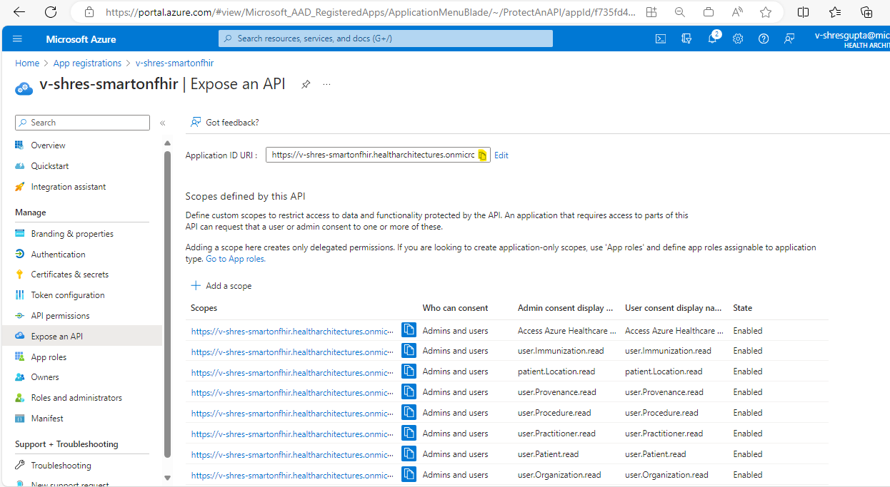

# Sample Deployment: SMART on FHIR

This document guides you through the steps needed to deploy this sample. This sample deploys Azure components, custom code, and Azure Active Directory configuration.

*Note:* This sample is not automated and on average will require at least a couple of hours to deploy end to end.

## 1. Prerequisites

In order to deploy this sample, you will need to install some Azure tools, ensure the proper administrator access to an Azure subscription / tenant, and have test user accounts for impersonating the patient and practitioner personas.

Make sure you have the pre-requisites listed below
- **Installation:**
  - [Git](https://git-scm.com/) to access the files in this repository.
  - [Azure CLI Version 2.51.0 or Greater](https://learn.microsoft.com/cli/azure/install-azure-cli) to run scripts that interact with Azure.
  - [Azure Developer CLI Version 1.2.0 or Greater](https://learn.microsoft.com/azure/developer/azure-developer-cli/install-azd?tabs=baremetal%2Cwindows) to deploy the infrastructure and code for this sample.
  - [Visual Studio](https://visualstudio.microsoft.com/), [Visual Studio Code](https://code.visualstudio.com/), or another development environment (for changing configuration debugging the sample code).
  - [Node Version 18.17.1/ NPM Version 10.2.0](https://docs.npmjs.com/downloading-and-installing-node-js-and-npm) for building the frontend application and installing the US Core FHIR Profile.
  - [.NET SDK Version 7.0.400](https://learn.microsoft.com/dotnet/core/sdk) installed (for building the sample).
  - [PowerShell Version 5.1.22621.2428 or Greater](https://learn.microsoft.com/powershell/scripting/install/installing-powershell) installed for running scripts (works for Mac and Linux too!).

- **Access:**
  - Access to an Azure Subscription where you can create resources and add role assignments.
  - Elevated access in Azure Active Directory (AD) and Microsoft Graph to create Application Registrations, assign Azure Active Directory roles, and add custom data to user accounts.

- **Test Accounts:**
  - Azure Active Directory test account to represent Patient persona. Make sure you have the object id of the user from Azure Active Directory.
  - Azure Active Directory test account to represent Provider persona. Make sure you have the object id of the user from Azure Active Directory.

## 2. Prepare and deploy environment

Next you will need to clone this repository and prepare your environment for deployment by creating two required Azure App Registrations and configuring your environment to use them.

1. Use the terminal or your git client to clone this repo. Open a terminal to the `samples/smartonfhir` folder.
1. Login with the Azure Developer CLI. Specify the tenant if you have more than one. `azd auth login` or `azd auth login --tenant-id <tenant-id>`. Also login with the Azure CLI using `az login`.
1. Run `azd env new` to create a new deployment environment.
    - *NOTE:* Environment name will be the prefix for all of your resources.
1. [Create the FHIR Resource App Registration. Use the instructions here](./ad-apps/fhir-resource-app-registration.md). Record the application id and application url for later.
1. [Create the Auth Context Frontend App Registration. Use the instructions here](./ad-apps/auth-context-frontend-app-registration.md). Record the application id and application url for later.
    - Make sure to tell azd about this application with `azd env set ContextAppClientId <context app id>`.
1. Set your deployment environment configuration.
    ```
    azd env set ApiPublisherName "Your Name"
    azd env set ApiPublisherEmail "Your Email"
    ```
1. Start the deployment of your environment by running the 'azd' command. This action will provision the infrastructure as well as deploy the code, which is expected to take about an hour.
    - When running this command, you must select the subscription name and location from the drop-down menus to specify the deployment location for all resources. 
    - Please be aware that this sample can only be deployed in the EastUS2, WestUS2, or CentralUS regions. Make sure you choose one of these regions during the deployment process.
    - The azd provision command will prompt users to enter values for the `existingResourceGroupName` and `fhirid` parameters. Users can provide values based on their requirements as below
        - `existingResourceGroupName` : This parameter allows the user to decide whether to deploy this sample in an existing resource group or to create a new resource group and deploy the sample. Leaving this parameter empty will create a new resource group named '{env_name}_rg' and deploy the sample. If the user provides an existing resource group, the sample will be deployed in that resource group.
                                        Note: An existing resource group should not have SMART on FHIR resource already deployed because multiple samples in the same resource group are not supported.
        - `fhirid`: This parameter allows user to decide whether to use existing FHIR service or create new one. Leaving this parameter empty will create new FHIR service. If user wish to use existing FHIR server then FHIR instance id need to be provided. Below are steps to retrieve the FHIR instance id 
            1. Navigate to your FHIR service.
            2. Click on properties in the left menu.
            3. Copy the ID field under essential.     
    - Some important considerations when using an existing FHIR service instance:
        - The FHIR server instance and SMART on FHIR resources are expected to be deployed in the same resource group, so enter the same resource group name in the `existingResourceGroupName` parameter.
        - Enable the system-assigned status in the existing FHIR service.
            1. Navigate to your existing FHIR Service.
            2. Proceed to the identity blade.
            3. Enable the status.
            4. Click on save.
        <br /><details><summary>Click to expand and see screenshots.</summary>
        
        </details>
    - Replace the FHIR Server Audience URL with FHIR Resource Application Registration Application ID URL which was created earlier for this SMART on FHIR sample, Follow the below steps
        1. Navigate to your FHIR Resource App Registration.
        2. Proceed to the "Expose an API" blade and copy the Application ID URI. 
        3. Go to your existing FHIR Service.
        4. Proceed to the authentication blade. 
        5. Paste the URL into the Audience field.
        <br /><details><summary>Click to expand and see screenshots.</summary>
        
        
        </details>
    - You can continue the setup below. 
    ```
    azd up
    ```

*NOTE:* This will take around 15 minutes to deploy.

## 3. Complete Setup of FHIR Resource and Auth Context Frontend Applications

### Assign Azure AD Permissions for the Auth Custom Operation API

As part of the scope selection flow, the Auth Custom Operation Azure Function will modify user permissions for the signed in user. This requires granting the Azure Managed Identity behind Azure Functions Application Administrator (or similar access).

1. Open the Azure Function for the SMART Auth Custom Operations. It will be suffixed by `aad-func`. Copy the Managed Identity for the next steps.
1. Open Azure Active Directory and navigate to `Roles and Administrators`. Open the `Application Administrator` role.
1. Add the Azure Function Managed Identity to this AAD role.

<br />
<details>
<summary>Click to expand and see screenshots.</summary>


</details>
<br />

### Set the Auth User Input Redirect URL

1. Open the resource group created by step 3. Find the Azure API Management instance.
1. Copy the Gateway URL for the API Management instance.
1. Open your Application Registration for the Auth Context Frontend you created before deployment. Add `<gatewayURL>/auth/context/` as a sinple-page application redirect URI. Make sure to add the last slash.
    - For example: `https://myenv-apim.azure-api.net/auth/context/`

<br />
<details>
<summary>Click to expand and see screenshots.</summary>


</details>
<br />

