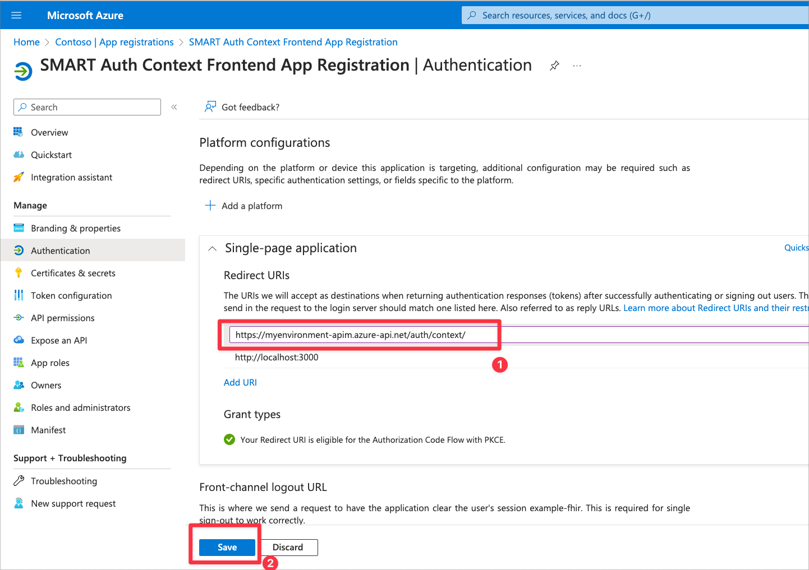

# Sample Deployment: SMART on FHIR

This document guides you through the steps needed to deploy this sample. This sample deploys Azure components, custom code, and Microsoft Entra Id configuration.

*Note:* This sample is not automated and on average will require at least a couple of hours to deploy end to end.

## 1. Prerequisites

In order to deploy this sample, you will need to install some Azure tools, ensure the proper administrator access to an Azure subscription / tenant, and have test user accounts for impersonating the patient and practitioner personas.

Make sure you have the pre-requisites listed below
- **Installation:**
  - [Git](https://git-scm.com/) to access the files in this repository.
  - [Azure CLI Version 2.51.0 or Greater](https://learn.microsoft.com/cli/azure/install-azure-cli) to run scripts that interact with Azure.
  - [Azure Developer CLI Version 1.2.0 or Greater](https://learn.microsoft.com/azure/developer/azure-developer-cli/install-azd?tabs=baremetal%2Cwindows) to deploy the infrastructure and code for this sample.
  - [Visual Studio](https://visualstudio.microsoft.com/), [Visual Studio Code](https://code.visualstudio.com/), or another development environment (for changing configuration debugging the sample code).
  - [Node Version 18.17.1/ NPM Version 10.2.0](https://docs.npmjs.com/downloading-and-installing-node-js-and-npm) for building the frontend application and installing the US Core FHIR Profile.
  - [.NET SDK Version 7.0.400](https://learn.microsoft.com/dotnet/core/sdk) installed (for building the sample).
  - [PowerShell Version 5.1.22621.2428 or Greater](https://learn.microsoft.com/powershell/scripting/install/installing-powershell) installed for running scripts (works for Mac and Linux too!).

- **Access:**
  - Access to an Azure Subscription where you can create resources and add role assignments.
  - Elevated access in Microsoft Entra Id and Microsoft Graph to create Application Registrations, assign Microsoft Entra Id roles, and add custom data to user accounts.

- **Test Accounts:**
  - Microsoft Entra Id test account to represent Patient persona. Make sure you have the object id of the user from Microsoft Entra Id.
  - Microsoft Entra Id test account to represent Provider persona. Make sure you have the object id of the user from Microsoft Entra Id.

- **Azure B2C SetUp:**
  - This setup is exclusively necessary for Smart on FHIR implementation with B2C. If you opt for Microsoft Entra Id, you can bypass this configuration.
  - Follow below mentioned steps:
    - [Create an Azure AD B2C tenant for the FHIR service](https://review.learn.microsoft.com/en-us/azure/healthcare-apis/fhir/azure-ad-b2c-setup?branch=main&branchFallbackFrom=pr-en-us-261649&tabs=powershell#create-an-azure-ad-b2c-tenant-for-the-fhir-service)
    - [Deploy an Azure AD B2C tenant by using an ARM template](https://review.learn.microsoft.com/en-us/azure/healthcare-apis/fhir/azure-ad-b2c-setup?branch=main&branchFallbackFrom=pr-en-us-261649&tabs=powershell#deploy-an-azure-ad-b2c-tenant-by-using-an-arm-template)
    - [Add a test B2C user to the Azure AD B2C tenant](https://review.learn.microsoft.com/en-us/azure/healthcare-apis/fhir/azure-ad-b2c-setup?branch=main&branchFallbackFrom=pr-en-us-261649&tabs=powershell#add-a-test-b2c-user-to-the-azure-ad-b2c-tenant)
    - [Link a B2C user with the fhirUser custom user attribute](https://review.learn.microsoft.com/en-us/azure/healthcare-apis/fhir/azure-ad-b2c-setup?branch=main&branchFallbackFrom=pr-en-us-261649&tabs=powershell#link-a-b2c-user-with-the-fhiruser-custom-user-attribute)
    - [Create a new B2C user flow](https://review.learn.microsoft.com/en-us/azure/healthcare-apis/fhir/azure-ad-b2c-setup?branch=main&branchFallbackFrom=pr-en-us-261649&tabs=powershell#create-a-new-b2c-user-flow)
    - Add two more Application Claims in B2C User Flow in B2C along with fhirUser claim, follow these steps:
        - Navigate to Azure AD B2C.
        - Select "User flows" from the menu.
        - Choose the recently created user flow.
        - Click on "Application claims."
        - Select `Display Name` (necessary for displaying the user's name on the frontend application) and `User's Object ID` (essential for obtaining the token).    
        <br /><details><summary>Click to expand and see screenshots.</summary>
        
        </details>

## 2. Prepare and deploy environment

Next you will need to clone this repository and prepare your environment for deployment by creating two required Azure App Registrations and configuring your environment to use them.

1. Use the terminal or your git client to clone this repo. Open a terminal to the `samples/smartonfhir` folder.
1. Login with the Azure CLI.
   - If you opt for B2C use `az login --tenant <B2CTenantDomainName> --allow-no-subscriptions`.
   - If you opt for Microsoft Entra Id use 
        ```
        az login --tenant <tenant-id>
        azd auth login --tenant-id <tenant-id>
        ```
1. Run `azd env new` to create a new deployment environment, keeping below points in mind.
    - Environment name must not exceed 18 characters in length.
    - Deployment fails if Environment name contains UpperCase Letters.
    - Use numbers and lower-case letters only for Environment name.
    - Environment name will be the prefix for all of your resources.
1. [Create the FHIR Resource App Registration. Use the instructions here](./ad-apps/fhir-resource-app-registration.md). Record the application id and application url for later.
1. [Create the Auth Context Frontend App Registration. Use the instructions here](./ad-apps/auth-context-frontend-app-registration.md). Record the application id and application url for later.
1. Set your deployment environment configuration.
    ```
    azd env set ApiPublisherName "Your Name"
    azd env set ApiPublisherEmail "Your Email"
    ```
1. [Create Inferno Standalone Patient App. Use the instructions here](./ad-apps/inferno-test-app-registration.md).
1. If you have opted for B2C, then set the deployment environment configuration.
    ```
    azd env set B2CTenantId <Tenant_ID_Of_B2C>
    azd env set AuthorityURL "https://<YOUR_B2C_TENANT_NAME>.b2clogin.com/<YOUR_B2C_TENANT_NAME>.onmicrosoft.com/<YOUR_USER_FLOW_NAME>/v2.0"
    azd env set StandaloneAppClientId <STANDALONE_APP_ID_CREATED_IN_STEP_7>
    azd env set SmartonFhirwithB2C true
    ```
    If you have opted for B2C, then set the deployment environment configuration.
    ```
    azd env set AuthorityURL "https://login.microsoftonline.com/<Microsoft Entra Id Tenant Id>/v2.0" 
    ```
1. Login with the Azure Developer CLI and start the deployment of your environment by running the 'azd' command. This action will provision the infrastructure as well as deploy the code, which is expected to take about an hour.
    ```
    az login --tenant <tenant-id>
    azd auth login --tenant-id <tenant-id>
    azd up
    ```
    - When running this command, you must select the `subscription name` and `location` from the drop-down menus to specify the deployment location for all resources. 
    - Please be aware that this sample can only be deployed in the EastUS2, WestUS2, or CentralUS regions. Make sure you choose one of these regions during the deployment process.
    - The azd provision command will prompt you to enter values for the `existingResourceGroupName` and `fhirid` parameters:
        - `existingResourceGroupName` : This parameter allows you to decide whether to deploy this sample in an existing resource group or to create a new resource group and deploy the sample. Leaving this parameter empty will create a new resource group named '{env_name}-rg' and deploy the sample. If you provide an existing resource group, the sample will be deployed in that resource group.
          - Note: If you are using an existing resource group, make sure that it does not already have a SMART on FHIR resource already deployed, because multiple samples in the same resource group are not supported.
          - Note: SMART on FHIR will need to be deployed in the same resource group as the associated FHIR server. 
        - `fhirid`: This parameter allows you to decide whether to use an existing FHIR service or create a new one. Leaving this parameter empty will create a new FHIR service. If you wish to use an existing FHIR server, input the FHIR instance ID. Below are steps to retrieve the FHIR instance ID: 
            1. Navigate to your FHIR service in Azure Portal.
            2. Click on properties in the left menu.
            3. Copy the "Id" field under the "Essentials" group.     
        - Some important considerations when using an existing FHIR service instance:
            - The FHIR server instance and SMART on FHIR resources are expected to be deployed in the same resource group, so enter the same resource group name in the `existingResourceGroupName` parameter.
            - Enable the system-assigned status in the existing FHIR service, Follow the below steps:
                1. Navigate to your existing FHIR Service in Azure Portal.
                2. Proceed to the Identity blade.
                3. Enable the status.
                4. Click on save.
            <br /><details><summary>Click to expand and see screenshots.</summary>
            
            </details>
    - If you are creating a new FHIR server as part of the SMART on FHIR deployment, you can skip this step. However, if you are using an existing FHIR server, you will need to complete this step:  
    The SMART on FHIR sample requires the FHIR server Audience URL to match the FHIR Resource Application Registration ID URL (which you created in Step 4 above). When you deploy the SMART on FHIR sample with a new FHIR server, the sample will automatically change the FHIR server Audience URL for you. If you use an existing FHIR server, you will need to do this step manually. 
        1. Navigate to your FHIR Resource App Registration.
        2. Proceed to the "Expose an API" blade and copy the Application ID URI. 
        3. Go to your existing FHIR Service.
        4. Proceed to the authentication blade. 
        5. Paste the URL into the Audience field.
        <br /><details><summary>Click to expand and see screenshots.</summary>
        
        
        </details>
> [!IMPORTANT]  
> If you are using an existing FHIR server, please note that in the above step, you needed to change the FHIR server Audience URL to the new Application Registration ID URL. If you have downstream apps that were using the previous FHIR server Audience URL, you will need to update those to point to the new URL.  


*NOTE:* This will take around 15 minutes to deploy. You can continue the setup below. 

## 3. Complete Setup of FHIR Resource and Auth Context Frontend Applications

### For Microsoft Entra Id user only - Assign Role to the Deployed or Existing Fhir Service

Ensure your test user has the role `FHIR SMART User` assigned to your FHIR Service deployed as part of this sample.
    - This role is what enables the SMART scope logic with your access token scopes in the FHIR Service.

### Assign Permissions for the Auth Custom Operation API

As part of the scope selection flow, the Auth Custom Operation Azure Function will modify user permissions for the signed in user. 

If you have opted for Microsoft Entra Id - This requires granting the Azure Managed Identity behind Azure Functions Application Administrator (or similar access).

1. Open the Azure Function for the SMART Auth Custom Operations. It will be suffixed by `aad-func`. Copy the Managed Identity for the next steps.
1. Open Microsoft Entra Id and navigate to `Roles and Administrators`. Open the `Application Administrator` role.
1. Add the Azure Function Managed Identity to this Microsoft Entra Id role.
    <br />
    <details>
    <summary>Click to expand and see screenshots.</summary>

    
    
    
    </details>
    <br />

If you have opted for B2C - This requires accessing the applications registered in B2C tenant Azure Function for the SMART Auth Custom Operations. You need to provide client secret of Standalone application in key vault. 

1. In the resource group that matches your environment, open the KeyVault with the suffix -kv.
1. Add a new secret that corresponds to the Standalone Application you just generated.
    - Name: `standalone-app-secret`
    - Secret: The secret you generated for the Standalone application

<br />

### Set the Auth User Input Redirect URL

1. Open the resource group created by step 3. Find the Azure API Management instance.
1. Copy the Gateway URL for the API Management instance.
1. Open your Application Registration for the Auth Context Frontend you created before deployment. Add `<gatewayURL>/auth/context/` as a sinple-page application redirect URI. Make sure to add the last slash.
    - For example: `https://myenv-apim.azure-api.net/auth/context/`

<br />
<details>
<summary>Click to expand and see screenshots.</summary>


</details>
<br />