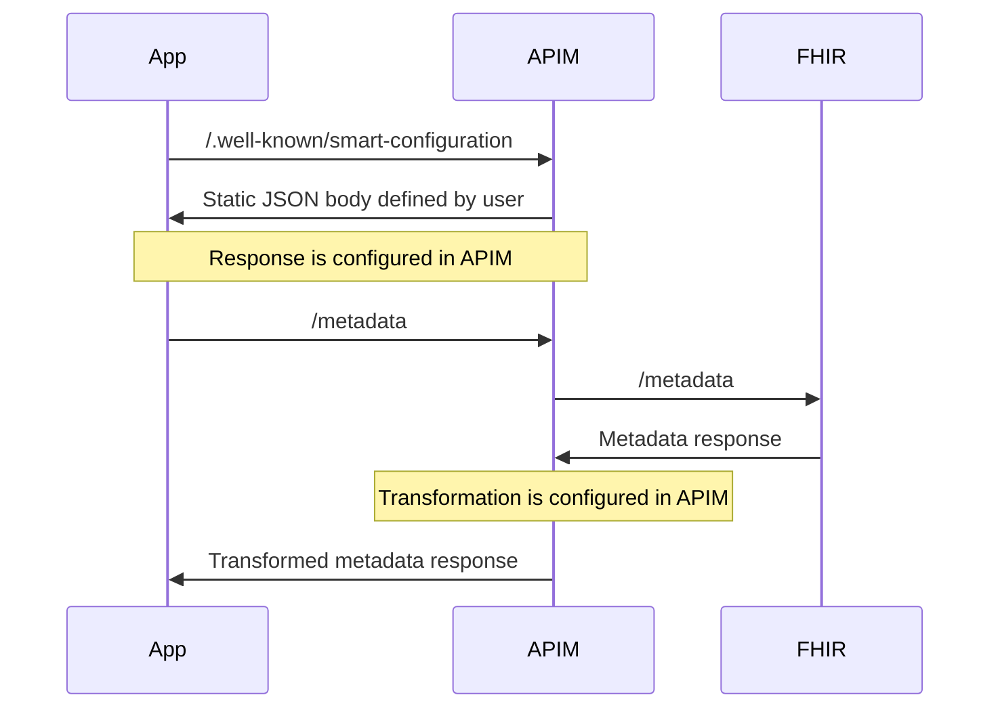
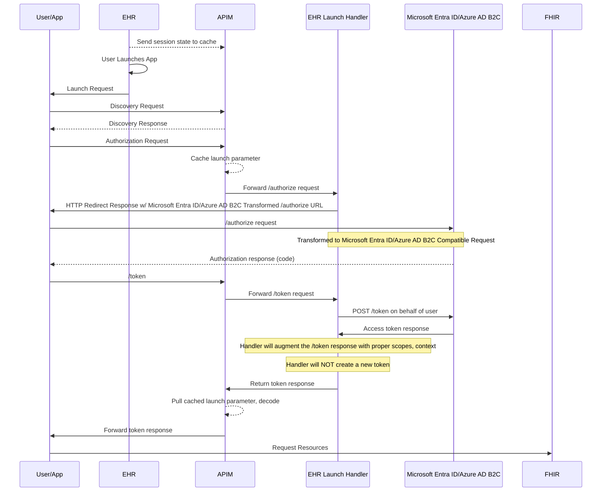
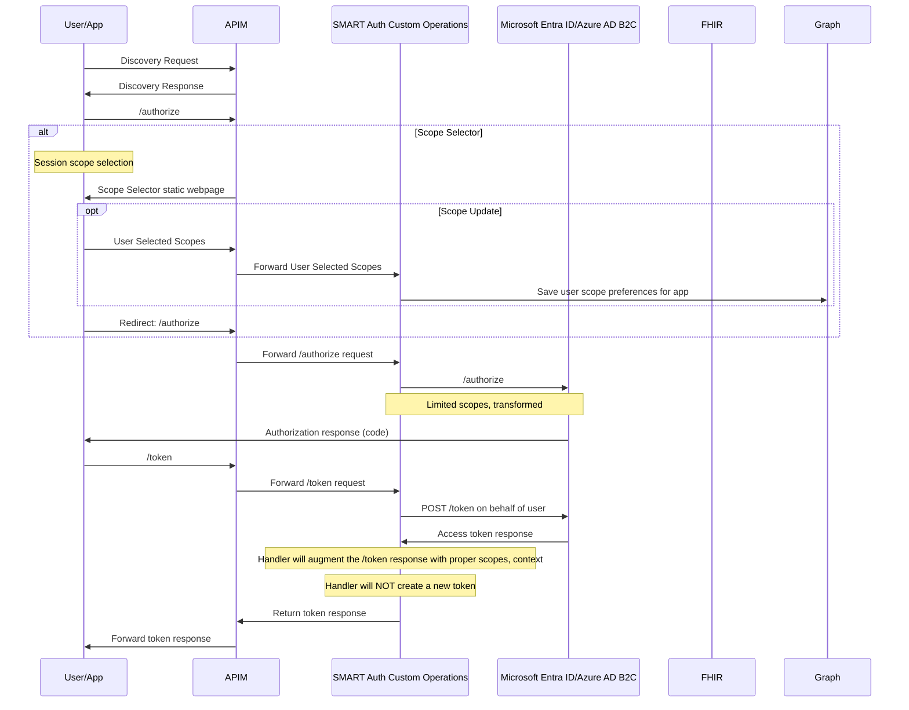

# Azure SMART on FHIR Technical Guide

This document describes how this SMART on FHIR sample works with Azure Health Data Services.

## Architecture Overview

To successfully use this SMART on FHIR sample, your Azure environment must be setup with the below resources.

- Azure Health Data Services with a FHIR Service
  - FHIR Service acts as the backend that stores and retrieves FHIR resources.
- Azure API Management
  - Used to manage the interactions between client applications and the Azure API for FHIR.
- Azure Function
  - Needed for certain SMART operations not supported by the FHIR Service or specific to your EHR.
    - Standalone Launch Handler enables the auth flow for standalone launch scenarios.
    - EHR Launch Handler enables the auth flow for EHR launch scenarios.
- Storage Account
  - Needed for Azure Function, assorted static assets, and configuration tables.
- Azure KeyVault
  - Needed for storing Azure AD B2C Application Client ID and Secret.
- Azure Static Web Apps
  - Needed for the Patient Standalone authorize flow to properly handle scopes. Microsoft Entra ID does not support session based scoping. 

## Conformance/Discovery

Conformance for SMART apps allows application developers to target many different EHRs in a unified way. Discovery is the method of which applications know how to interact with a specific EHR. See the [SMART implementation guide](https://www.hl7.org/fhir/smart-app-launch/conformance.html) for more details. There are two different discovery endpoints for SMART on FHIR servers:

- The capability statement (`/metadata`) which holds information about the entire FHIR server.
- The SMART on FHIR Well-Known endpoint (`/.well-known/smart-configuration`) which holds SMART on FHIR specific configuration.

Azure Health Data Services needs some modification to the capability statement and the addition of the SMART on FHIR Well-Known endpoint. We can easily meet both of these with a couple of API Management policy.

- Capability statement policy to transform the conformance statement using a `setBody` policy.
  - Adds our authorize and token Azure Function endpoints so clients know where to authenticate.
  - Change the conformance so signify that we can handle SMART on FHIR clients.
- SMART on FHIR Well-Known policy to return a static string for our SMART on FHIR configuration.

**NOTE:** This will result in a separate conformance statement for clients accessing via API Management versus directly through the FHIR Service since this sample is adding additional capabilities to Azure Health Data Services.

## EHR Launch

## Standalone Launch

SMART standalone launch refers to when an app launches from outside an EHR session. Generally these are patient facing apps since patients often do not access an EHR to view their data (patients could have EHR launch apps from an EHR patient portal). This flow often relies on user input for establishing the correct context for the SMART application since there is no session data to pull from. There are two potential scenarios where an EHR application may need to gather input from the user:

- Selecting a record (like a patient) when a user has access to multiple patients (like parent/child relationship)
- Reviewing and granting limited scopes to an application to control how much of the patient's data the SMART app can access

*I think (need to verify)* ONC (g)(10) does not require a patient picker, so it is out of scope for this sample. If we need it, it's not too bad.

Microsoft Entra ID does not have a mechanism for selecting a subset of scopes when approving/denying an application. Due to this, we have to serve a custom scope selection interface for standalone launch scenarios.

## Resources

- [SMART on FHIR 1.0 Implementation Guide](https://hl7.org/fhir/smart-app-launch/1.0.0/)

**[Back to Previous Page](../README.md)**